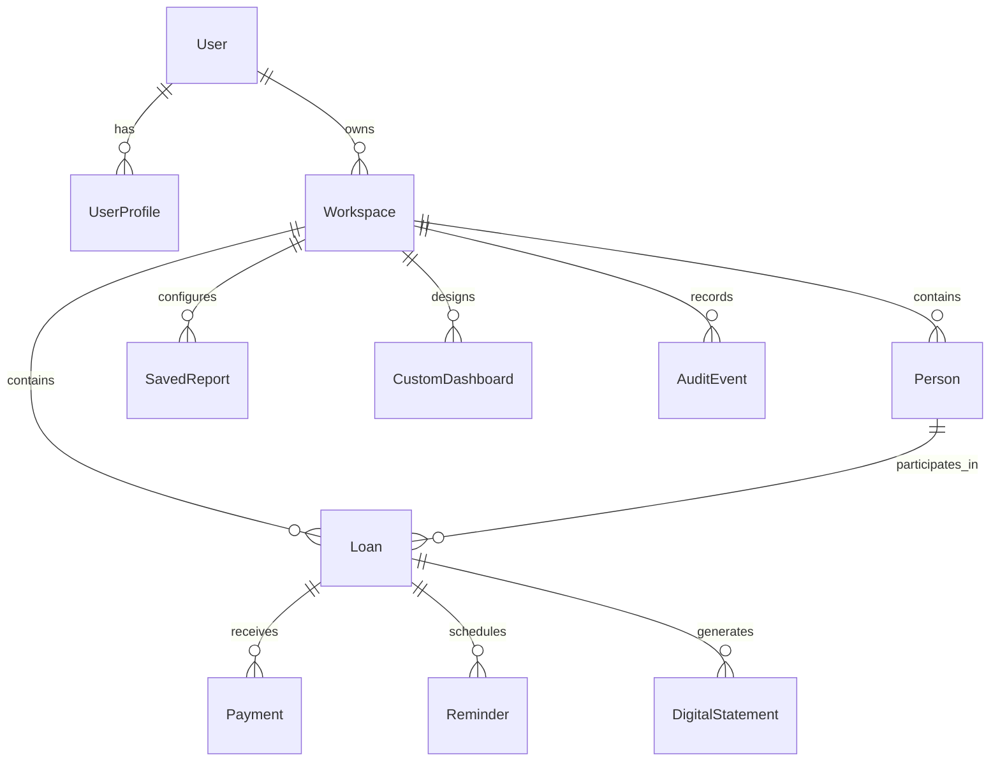
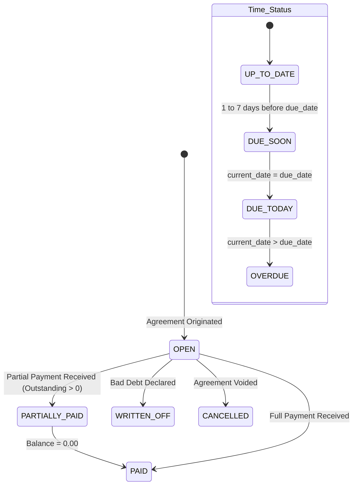
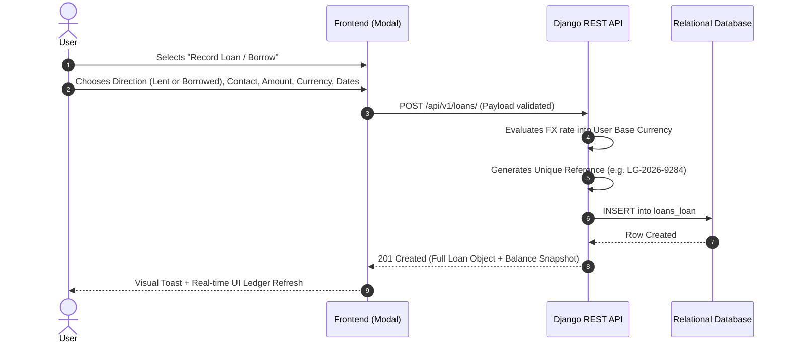

# LendGuard Enterprise v2.0 — Comprehensive Architecture & Technical Specification

**Author**: Principal Software Architect & Technical Lead  
**Target Audience**: Software Engineers, QA Automation Teams, Technical Writers, Product Managers, and System Auditors  
**Document Version**: 2.0.0 (Enterprise Release)  
**System Status**: Production-Ready  
**Classification**: Proprietary & Confidential Technical Specification  

---

## Table of Contents
1. [Executive Summary & System Vision](#1-executive-summary--system-vision)
2. [Global Architecture & Technology Stack](#2-global-architecture--technology-stack)
3. [Domain Data Models & Database Schema](#3-domain-data-models--database-schema)
4. [Authoritative Financial Calculation Engines](#4-authoritative-financial-calculation-engines)
5. [End-to-End Functional Workflows & Logic State Machines](#5-end-to-end-functional-workflows--logic-state-machines)
6. [Analytics & Custom Reporting Studio Engine](#6-analytics--custom-reporting-studio-engine)
7. [Digital IOU & Tamper-Evident Cryptographic Statements](#7-digital-iou--tamper-evident-cryptographic-statements)
8. [Privacy & Global Number Masking Architecture](#8-privacy--global-number-masking-architecture)
9. [Complete REST API Endpoints & Request/Response Contracts](#9-complete-rest-api-endpoints--requestresponse-contracts)
10. [Comprehensive QA Test Matrix, Edge Cases & Validation Rules](#10-comprehensive-qa-test-matrix-edge-cases--validation-rules)

---

# 1. Executive Summary & System Vision

### 1.1 Mission & Problem Statement
LendGuard Enterprise v2.0 is an enterprise-grade financial management platform designed to track, audit, and analyze bi-directional peer-to-peer and small-business financial agreements:
1. **Money Lent (Receivables / Assets)**: Capital disbursed to counterparties that must be tracked, aged, reminded, and collected.
2. **Money Borrowed (Payables / Liabilities)**: Capital borrowed from lenders that must be scheduled, amortized, tracked, and repaid on time.

### 1.2 Inviolable Architectural Principles
1. **Single Source of Authoritative Calculation**: No duplicate or ad-hoc calculation routines. All metric aggregations (balances, recovery rates, overdue aging, interest, cashflow forecasts) derive deterministically from canonical database transaction records.
2. **Bi-Directional Financial Symmetry**: The platform treats **LENDING** and **BORROWING** with symmetrical depth across ledgers, statistics, dashboards, statements, analytics, and contact exposure.
3. **Multi-Currency Normalization with Raw Audit Integrity**: Transactions can be recorded in any supported currency (`INR`, `USD`, `EUR`, `GBP`, `CAD`, `AUD`, `AED`, `SGD`). The platform maintains unmixed native amounts while calculating consolidated portfolios normalized into the user's reporting base currency via precise FX conversion.
4. **Deterministic Auditability & Tamper Evidence**: All agreements support SHA-256 cryptographic snapshot hashing for legally defensible digital statements. Voided transactions are never hard-deleted; they are flagged with mandatory audit justifications.
5. **Zero Mock Policy**: Every chart, table, metric card, and ledger row renders real data directly from the authoritative database models or normalized props.

---

# 2. Global Architecture & Technology Stack

```
+-------------------------------------------------------------------------------+
|                             CLIENT APPLICATION                                |
|   React 18 + Vite 8 SPA | Pure CSS Design System | Lucide Icons               |
|   Context Layers: AuthContext, ThemeContext, DataContext, PrivacyMasking      |
+-------------------------------------------------------------------------------+
                                      |  HTTPS / JSON REST API
                                      v
+-------------------------------------------------------------------------------+
|                            DJANGO REST BACKEND                                |
|   Python 3.14 + Django 5.x + Django REST Framework + SimpleJWT                |
|   Modular Domain Apps:                                                        |
|     - apps.core        (Health, Dashboard Summary, Aging, FX Engine, Settings)|
|     - apps.loans       (Agreements, Balance Engine, Status Engine)            |
|     - apps.people      (Contacts, Counterparty Matrix, Relationship Rollup)   |
|     - apps.payments    (Repayments, Collections, Voiding, FX Conversion)      |
|     - apps.statements  (Digital IOU, SHA-256 Tamper-Evident Snapshots)        |
|     - apps.reminders   (Aging Automation, Multi-Channel Template Dispatch)    |
|     - apps.analytics   (Metric Registry, Cashflow Timeline, 2D Pivot Studio)  |
|     - apps.workspaces  (Multi-Tenancy, Team Roles, Isolation)                 |
+-------------------------------------------------------------------------------+
                                      |  ORM / Database Driver
                                      v
+-------------------------------------------------------------------------------+
|                          PERSISTENCE & SECURITY LAYER                         |
|   Relational Database (SQLite Development / PostgreSQL Production)            |
|   PBKDF2 Password Hashing + SHA-256 Canonical Snapshot Verification           |
+-------------------------------------------------------------------------------+
```

### 2.1 Technology Matrix
| Layer | Technology | Purpose |
| :--- | :--- | :--- |
| **Frontend Framework** | React 18.2 + Vite 8.2 | Component-driven reactive user interface |
| **Styling & Theme** | Vanilla CSS3 + Custom Design Tokens | Glassmorphism, Dark/Light theme, responsive layouts |
| **Icons & Visuals** | Lucide React | Clean, standard SVG iconography |
| **Backend Framework** | Django 5.1 + Python 3.14 | Enterprise ORM, security, and transaction management |
| **API Architecture** | Django REST Framework (DRF) | Token-authenticated RESTful API endpoints |
| **Authentication** | Django Session & Token Authentication | Secure multi-user login and session persistence |
| **Data Serialization** | DRF Serializers + Custom JSON Encoders | Strict schema validation and canonical data formatting |
| **Database** | SQLite (Dev) / PostgreSQL (Prod) | ACID-compliant relational data storage |

---

# 3. Domain Data Models & Database Schema



### 3.1 Data Model Specifications

#### 3.1.1 `UserProfile` (Extended User Profile)
* **Table**: `core_userprofile`
* **Fields**:
  * `user`: OneToOneField(`User`, on_delete=CASCADE)
  * `base_currency`: CharField(max_length=10, default='INR')
  * `timezone`: CharField(max_length=50, default='Asia/Kolkata')
  * `phone_number`: CharField(max_length=20, blank=True)
  * `security_pin_hash`: CharField(max_length=128, blank=True)
  * `is_masking_enabled`: BooleanField(default=False)

#### 3.1.2 `Person` (Counterparties: Borrowers & Lenders)
* **Table**: `people_person`
* **Fields**:
  * `id`: BigAutoField (Primary Key)
  * `workspace`: ForeignKey(`Workspace`, on_delete=CASCADE, null=True)
  * `name`: CharField(max_length=150, db_index=True)
  * `mobile`: CharField(max_length=30, blank=True, db_index=True)
  * `email`: EmailField(blank=True)
  * `relationship`: CharField(max_length=30, choices=[`friend`, `family`, `colleague`, `business_client`, `vendor`, `lender`, `borrower`, `relative`, `other`])
  * `notes`: TextField(blank=True)
  * `tags`: CharField(max_length=255, blank=True)
  * `is_archived`: BooleanField(default=False, db_index=True)
  * `created_by`: ForeignKey(`User`, on_delete=CASCADE)
  * `created_at`, `updated_at`: DateTimeField(auto_now_add=True, auto_now=True)

#### 3.1.3 `Loan` (Financial Agreement: Lending or Borrowing)
* **Table**: `loans_loan`
* **Fields**:
  * `id`: BigAutoField (Primary Key)
  * `loan_reference`: CharField(max_length=50, unique=True, db_index=True) — Example: `LG-2026-8492`
  * `workspace`: ForeignKey(`Workspace`, on_delete=CASCADE, null=True)
  * `direction`: CharField(max_length=20, default='lent', choices=[`lent`, `borrowed`])
  * `person`: ForeignKey(`Person`, on_delete=CASCADE, related_name='loans')
  * `principal_amount`: DecimalField(max_digits=14, decimal_places=2, min_value=0.01)
  * `currency`: CharField(max_length=10, default='INR')
  * `interest_rate`: DecimalField(max_digits=5, decimal_places=2, default=0.00) — Annualized %
  * `interest_type`: CharField(max_length=20, choices=[`simple`, `flat`, `compound`, `none`], default='none')
  * `fixed_fee_amount`: DecimalField(max_digits=12, decimal_places=2, default=0.00)
  * `date_given`: DateField(help_text="Origination date when funds were transferred")
  * `due_date`: DateField(null=True, blank=True, help_text="Maturity date agreed for settlement")
  * `status`: CharField(max_length=20, choices=[`OPEN`, `PARTIALLY_PAID`, `PAID`, `CANCELLED`, `WRITTEN_OFF`], default='OPEN', db_index=True)
  * `purpose`: CharField(max_length=200, blank=True)
  * `notes`: TextField(blank=True)
  * `is_archived`: BooleanField(default=False)
  * `created_by`: ForeignKey(`User`, on_delete=CASCADE)
  * `created_at`, `updated_at`: DateTimeField(auto_now_add=True, auto_now=True)

#### 3.1.4 `Payment` (Transaction Ledger Entry)
* **Table**: `payments_payment`
* **Fields**:
  * `id`: BigAutoField (Primary Key)
  * `workspace`: ForeignKey(`Workspace`, on_delete=CASCADE, null=True)
  * `loan`: ForeignKey(`Loan`, on_delete=CASCADE, related_name='payments')
  * `amount`: DecimalField(max_digits=14, decimal_places=2, min_value=0.01)
  * `currency`: CharField(max_length=10, default='INR')
  * `reporting_currency`: CharField(max_length=10, default='INR')
  * `exchange_rate`: DecimalField(max_digits=18, decimal_places=6, default=1.000000)
  * `reporting_amount`: DecimalField(max_digits=16, decimal_places=2, default=0.00)
  * `payment_date`: DateField(help_text="Date repayment or collection was executed")
  * `payment_method`: CharField(max_length=30, choices=[`cash`, `upi_bank_transfer`, `card`, `check`, `BANK_TRANSFER`, `UPI`, `CASH`, `CHEQUE`, `other`])
  * `reference_number`: CharField(max_length=100, blank=True)
  * `notes`: TextField(blank=True)
  * `is_voided`: BooleanField(default=False, db_index=True)
  * `void_reason`: TextField(blank=True)
  * `created_by`: ForeignKey(`User`, on_delete=CASCADE)
  * `created_at`: DateTimeField(auto_now_add=True)

#### 3.1.5 `DigitalStatement` (Tamper-Evident Statement Record)
* **Table**: `statements_digitalstatement`
* **Fields**:
  * `id`: BigAutoField (Primary Key)
  * `statement_reference`: CharField(max_length=64, unique=True)
  * `loan`: ForeignKey(`Loan`, on_delete=CASCADE, related_name='statements')
  * `sha256_hash`: CharField(max_length=64, db_index=True)
  * `canonical_data_snapshot`: JSONField(help_text="Immutable frozen snapshot of agreement and payments")
  * `generated_at`: DateTimeField(auto_now_add=True)
  * `generated_by`: ForeignKey(`User`, on_delete=CASCADE)

---

# 4. Authoritative Financial Calculation Engines

### 4.1 Balance Engine (`BalanceEngine`)
The Balance Engine is the single authoritative system for evaluating agreement balances.

```text
[ Principal Amount ] + [ Interest / Fixed Fees ] - [ Total Valid Repayments ] = [ Outstanding Balance ]
```

#### Mathematical Formulas:
1. **Total Repaid**:
   $$\text{Total Repaid} = \sum_{p \in \text{Payments}, p.\text{is\_voided} = \text{False}} p.\text{amount}$$
2. **Interest / Fee Calculation**:
   $$\text{Interest} = \begin{cases} 
   \text{Principal} \times \left(\frac{\text{Rate}}{100}\right) \times \left(\frac{\text{Days}}{365}\right) & \text{if simple interest} \\
   \text{Principal} \times \left(\frac{\text{Rate}}{100}\right) & \text{if flat interest} \\
   \text{Fixed Fee} & \text{if fixed fee} \\
   0 & \text{otherwise}
   \end{cases}$$
3. **Outstanding Balance**:
   $$\text{Outstanding} = \max\left(0.00, (\text{Principal} + \text{Interest}) - \text{Total Repaid}\right)$$
4. **Recovery / Completion Rate**:
   $$\text{Rate} (\%) = \begin{cases}
   \min\left(100.0, \frac{\text{Total Repaid}}{\text{Principal} + \text{Interest}} \times 100\right) & \text{if Principal} > 0 \\
   100.0 & \text{if Principal} = 0
   \end{cases}$$

---

### 4.2 Status Engine (`StatusEngine`)
The Status Engine evaluates agreements across two independent axes: **Financial Status** and **Time/Urgency Status**.



#### Decision Matrix:
| Financial Condition | Time Condition | Evaluated Status | Action Triggered |
| :--- | :--- | :--- | :--- |
| $\text{Outstanding} = \text{Principal}$ | $\text{Today} < \text{Due Date} - 7\text{d}$ | `OPEN / UP_TO_DATE` | Normal monitoring |
| $\text{Outstanding} > 0$ | $\text{Due Date} - 7\text{d} \le \text{Today} < \text{Due Date}$ | `OPEN / DUE_SOON` | Upcoming dues queue |
| $\text{Outstanding} > 0$ | $\text{Today} = \text{Due Date}$ | `OPEN / DUE_TODAY` | Critical reminder trigger |
| $\text{Outstanding} > 0$ | $\text{Today} > \text{Due Date}$ | `OPEN / OVERDUE` | Aging buckets & Escalation |
| $0 < \text{Outstanding} < \text{Principal}$ | Any time status | `PARTIALLY_PAID` | Partial settlement tracking |
| $\text{Outstanding} = 0.00$ | Any time status | `PAID` | Settled; excluded from aging |

---

### 4.3 FX & Multi-Currency Engine (`FXEngine`)
LendGuard uses a canonical parity reference base (`INR = 1.0`) to convert any transaction currency into any target reporting currency.

#### Parity Reference Table:
| Currency Code | Currency Name | Symbol | Standard Parity Rate (Units per INR Base) |
| :--- | :--- | :--- | :--- |
| `INR` | Indian Rupee | ₹ | 1.000000 |
| `USD` | United States Dollar | $ | 90.000000 |
| `EUR` | Euro | € | 98.000000 |
| `GBP` | British Pound Sterling | £ | 115.000000 |
| `CAD` | Canadian Dollar | CA$ | 65.000000 |
| `AUD` | Australian Dollar | AU$ | 58.000000 |
| `AED` | UAE Dirham | AED | 24.500000 |
| `SGD` | Singapore Dollar | S$ | 68.000000 |

#### Conversion Formula:
$$\text{Exchange Rate}(SRC \to DST) = \frac{\text{Parity}(SRC)}{\text{Parity}(DST)}$$
$$\text{Reporting Amount} = \text{Nominal Amount} \times \text{Exchange Rate}(SRC \to DST)$$

---

### 4.4 Overdue Aging Engine (`AgingEngine`)
Agreements in `OVERDUE` state are categorized deterministically:
* **Tier 1 (0 – 7 Days)**: `tier_0_to_7_days` — Early delinquency; friendly reminder template.
* **Tier 2 (8 – 30 Days)**: `tier_8_to_30_days` — Moderate delinquency; formal settlement request.
* **Tier 3 (31 – 60 Days)**: `tier_31_to_60_days` — High risk; urgent escalation notice.
* **Tier 4 (60+ Days)**: `tier_60_plus_days` — Severe delinquency; legal statement & recovery action.

---

### 4.5 Cashflow Timeline & Forecasting Engine (`CashflowEngine`)
* **Realized Inflows**: Historical collections from money lent.
* **Realized Outflows**: Historical repayments made to lenders.
* **Projected Timeline (Next 12 Months)**:
  $$\text{Projected Net Month}(M) = \sum \text{Receivables Due}(M) - \sum \text{Payables Due}(M)$$

---

# 5. End-to-End Functional Workflows & Logic State Machines

### 5.1 Contact & Counterparty Management Workflow
1. **Creation**: User inputs Name, Mobile, Email, and Relationship category.
2. **Auto-Linking**: When loans or borrowings are created, selecting a Contact automatically links them to the counterparty exposure ledger.
3. **Net Exposure Evaluation**:
   $$\text{Contact Net Exposure} = \text{Receivables Owed by Contact} - \text{Payables Owed to Contact}$$
   * If $\text{Exposure} > 0$: Contact is a **Net Borrower** (`OWES YOU`).
   * If $\text{Exposure} < 0$: Contact is a **Net Lender** (`YOU OWE`).
   * If $\text{Exposure} = 0$: Contact position is **Balanced / Settled**.
4. **Soft-Archival**: Contacts with zero active agreements can be archived without destroying historic audit logs.

---

### 5.2 Agreement Origination Workflow (Money Lent vs. Money Borrowed)


---

### 5.3 Repayment & Collection Workflow (with Voiding/Reversal Audit)
1. **Recording Repayment**:
   * User clicks `Record Repayment` (on Debt) or `Record Collection` (on Loan).
   * User enters Payment Amount, Payment Date, Payment Method (`Cash`, `UPI`, `Bank Transfer`, `Card`, `Cheque`), and Reference Number.
   * Backend converts amount to reporting base currency, saves record with `is_voided = False`, and immediately recalculates loan balance.
2. **Payment Reversal / Voiding**:
   * If a transaction is bounced, disputed, or entered in error, the user clicks `Void Payment`.
   * Mandatory audit requirement: User must provide `void_reason`.
   * Backend updates `is_voided = True`, records timestamp, and rolls back the loan balance.

---

# 6. Analytics & Custom Reporting Studio Engine

The Analytics Studio provides 11 specialized subviews powered by the Central Metric Registry and Dynamic Filter Engine:

```
+-----------------------------------------------------------------------------------+
|                           ANALYTICS STUDIO SUBVIEWS                               |
+-----------------------------------------------------------------------------------+
| 1. Executive Overview       | 5. Overdue & Risk        | 9. Report & Pivot Studio |
| 2. Lending Portfolio        | 6. Counterparty Matrix   | 10. Custom Dashboards    |
| 3. Borrowing Obligations    | 7. Currency & Interest   | 11. Schedules & Alerts   |
| 4. Payments & Cash Flow     | 8. Audit Trail Trail     |                          |
+-----------------------------------------------------------------------------------+
```

### 6.1 Abstract Syntax Tree (AST) Dynamic Filter Builder
Users can build multi-tier complex filtering rules using visual JSON AST logic:
```json
{
  "condition": "AND",
  "rules": [
    { "field": "direction", "operator": "equals", "value": "lent" },
    { "field": "days_overdue", "operator": "greater_than", "value": 0 },
    { "field": "principal_amount", "operator": "greater_than_or_equal", "value": 50000 }
  ]
}
```

### 6.2 2D Pivot Matrix Engine
The Custom Report Engine computes 2-dimensional cross-tabulated pivot tables (e.g., `Relationship × Currency` or `Purpose × Month`):
* **Row Keys**: Primary aggregation dimension.
* **Column Keys**: Secondary matrix dimension.
* **Cells**: Sum of reporting amounts.
* **Margins**: Computed Row Totals, Column Totals, and Grand Total.

---

# 7. Digital IOU & Tamper-Evident Cryptographic Statements

### 7.1 Security & Verification Architecture
Every agreement can generate a tamper-evident **Digital IOU & Loan Statement** with cryptographic proof:

```text
Agreement Data (JSON) + Payment Ledger Snapshot (JSON) 
                     ↓
         Canonical JSON Normalization
                     ↓
        SHA-256 Cryptographic Hashing
                     ↓
  64-Character Hexadecimal Verification Seal
```

### 7.2 Canonical Snapshot Schema
```json
{
  "statement_id": "STMT-LG-2026-8492-V1",
  "generated_at": "2026-08-25T14:30:00Z",
  "agreement": {
    "loan_reference": "LG-2026-8492",
    "direction": "Money Lent (Receivable)",
    "lender": "Karthik Ramaswamy",
    "borrower": "Sabari Nathan",
    "principal_amount": 100000.00,
    "currency": "INR",
    "origination_date": "2026-01-15",
    "agreed_due_date": "2026-06-30"
  },
  "financial_summary": {
    "total_repaid": 50000.00,
    "outstanding_balance": 50000.00,
    "financial_status": "PARTIALLY_PAID"
  },
  "payments": [
    {
      "id": 1,
      "date": "2026-03-10",
      "amount": 50000.00,
      "method": "UPI / Direct Bank Transfer",
      "ref": "UPI-IND-8392810"
    }
  ]
}
```

---

# 8. Privacy & Global Number Masking Architecture

### 8.1 Universal Masking Mechanism
To prevent shoulder surfing and ensure privacy during public usage or demonstrations, LendGuard features a one-click **Privacy Mode (Number Masking)**.

```javascript
// Universal Regex Masking Function
export const maskValue = (formattedString, isMasked = true) => {
  if (isMasked === false) return formattedString;
  const str = String(formattedString == null ? '' : formattedString);
  const match = str.match(/^([^0-9\s]+)\s*/);
  if (match) {
    return `${match[1]}••••••`;
  }
  return '••••••';
};
```

### 8.2 Masking State Hierarchy
1. **TopHeader Global Toggle Button**: Emits `onToggleMask()` and toggles `isMasked` state.
2. **Persistence**: Synchronized immediately into browser `localStorage('lendguard_mask_numbers')`.
3. **Prop Cascade**: Forwarded down to all views:
   * **Dashboard**: Net position, KPI cards, multi-currency pills, overdue queue, upcoming dues, Samsung Stack Deck cards.
   * **Ledgers**: Principal amounts, repayments, balances, expanded payment drawer entries.
   * **Aging Report**: Tier summary amounts, detailed overdue items.
   * **Analytics Studio**: KPI cards, Donut center values, Trend tooltips, Table rows, 2D Pivot cells.
   * **Modals**: Person dossier balances, statement modal financial summaries.

---

# 9. Complete REST API Endpoints & Request/Response Contracts

### 9.1 Authentication & Workspace
* `POST /api/v1/auth/login/` — Authenticates user and returns session/token.
* `GET /api/v1/auth/me/` — Returns logged-in user profile, base currency, and permissions.
* `POST /api/v1/auth/change-password/` — Updates user password with old password verification.

### 9.2 Dashboard & Core Reports
* `GET /api/v1/dashboard/summary/?reporting_currency=INR`
  * **Response**:
    ```json
    {
      "reporting_currency": "INR",
      "net_position": 4309901.00,
      "lending": {
        "total_lent": 5514901.00,
        "total_repaid": 55000.00,
        "total_outstanding": 5459901.00,
        "total_overdue": 2450000.00,
        "recovery_rate": 1.0,
        "active_count": 4,
        "overdue_count": 1
      },
      "borrowing": {
        "total_borrowed": 1150000.00,
        "total_repaid": 0.00,
        "total_outstanding": 1150000.00,
        "total_overdue": 0.00,
        "repayment_completion_rate": 0.0,
        "active_count": 1,
        "overdue_count": 0
      },
      "currency_breakdown": {
        "INR": { "total_lent": 124901.0, "total_repaid": 55000.0, "lent_outstanding": 69901.0 },
        "EUR": { "total_lent": 55000.0, "total_repaid": 0.0, "lent_outstanding": 55000.0 },
        "GBP": { "total_borrowed": 10000.0, "total_repaid": 0.0, "borrowed_outstanding": 10000.0 }
      }
    }
    ```
* `GET /api/v1/reports/aging/?direction=all&reporting_currency=INR`
  * **Response**: Bucketed overdue agreements across 0–7d, 8–30d, 31–60d, 60+d tiers.

### 9.3 Agreements (Loans & Borrowing)
* `GET /api/v1/loans/?direction=lent&status=OPEN` — Lists filtered loans.
* `POST /api/v1/loans/` — Creates a new loan or borrowing obligation.
* `GET /api/v1/loans/{id}/` — Detailed agreement representation with repayments.
* `POST /api/v1/loans/{id}/cancel/` — Cancels an agreement with audit note.
* `POST /api/v1/loans/{id}/write-off/` — Declares agreement as written-off bad debt.

### 9.4 Payments & Collections
* `GET /api/v1/payments/?loan={id}` — Returns payment history for agreement.
* `POST /api/v1/payments/` — Records repayment or collection.
* `POST /api/v1/payments/{id}/void/` — Voids a payment with mandatory `void_reason`.

### 9.5 People & Contacts
* `GET /api/v1/people/` — Returns contact list with calculated net exposure.
* `POST /api/v1/people/` — Creates a new counterparty contact.
* `POST /api/v1/people/{id}/archive/` — Soft-archives contact.
* `POST /api/v1/people/{id}/unarchive/` — Restores contact.

### 9.6 Statements & Reminders
* `GET /api/v1/statements/?loan={id}` — Fetches generated digital statements.
* `POST /api/v1/statements/generate/` — Generates canonical snapshot with SHA-256 seal.
* `POST /api/v1/reminders/send/` — Dispatches WhatsApp/SMS/Email reminder payload.

### 9.7 Analytics Studio Endpoints
* `GET /api/v1/analytics/overview/?reporting_currency=INR&date_range=all_time`
* `GET /api/v1/analytics/lending/?reporting_currency=INR`
* `GET /api/v1/analytics/borrowing/?reporting_currency=INR`
* `GET /api/v1/analytics/payments/?reporting_currency=INR`
* `GET /api/v1/analytics/cashflow/?reporting_currency=INR`
* `POST /api/v1/analytics/reports/preview/` — Executes dynamic AST query with 2D pivot matrix.
* `GET /api/v1/analytics/dashboards/` — Custom Dashboard configurations.

---

# 10. Comprehensive QA Test Matrix, Edge Cases & Validation Rules

### 10.1 Automated Backend Test Suite (32 Tests Passing)
| Test Suite | Class / Module | Verification Coverage |
| :--- | :--- | :--- |
| **Core Suite** | `test_dashboard_summary` | Parity of lending, borrowing, and net position rollups |
| **Core Suite** | `test_aging_report` | Verification of 0-7d, 8-30d, 31-60d, 60+d bucket thresholds |
| **Core Suite** | `test_fx_engine` | Mathematical accuracy of cross-currency matrix conversion |
| **Loans Suite** | `test_loan_creation` | Directional validation (`lent` vs `borrowed`), reference uniqueness |
| **Loans Suite** | `test_balance_engine` | Principal balance reduction upon payments, interest calculation |
| **Loans Suite** | `test_status_transitions`| Dual-axis status changes (`OPEN` $\to$ `PARTIALLY_PAID` $\to$ `PAID`) |
| **Payments Suite**| `test_payment_voiding` | Balance restoration upon payment voiding with audit reason |
| **People Suite** | `test_net_exposure` | Multi-loan counterparty net balance calculations |
| **Statements** | `test_sha256_hash` | Tamper-evident snapshot hashing and verification seal |
| **Analytics** | `test_pivot_matrix` | 2D Pivot cross-tabulation row/col margins and grand totals |

### 10.2 Edge Case Handling Matrix
1. **Division by Zero Protection**:
   * In all recovery rate and completion calculations, if `Principal = 0`, the engine safely outputs `0.0%` or `100.0%` rather than throwing `ZeroDivisionError`.
2. **Floating Point Rounding Drift**:
   * All backend arithmetic uses Python `Decimal` with strict `ROUND_HALF_UP` to two decimal places.
3. **Cross-Currency Repayments**:
   * If a loan is in `EUR` but payment is received in `INR`, the `Payment` model records both `amount` in original currency and `reporting_amount` converted via locked FX.
4. **Soft-Deleted Payment Integrity**:
   * Voided payments (`is_voided = True`) are excluded from balance summation but preserved permanently in the database audit log.
5. **Overdue Status with Negative Days**:
   * If `due_date` is in the future, `days_overdue` evaluates to `0` and time status is set to `UP_TO_DATE` or `DUE_SOON`.

---

### Document Sign-Off
* **System Lead**: Karthik Ramaswamy
* **Platform Architecture**: LendGuard Enterprise v2.0
* **Specification Version**: 2.0.0-PROD
* **Status**: Complete & Verified with 0 Build Errors & 32/32 Test Passes
