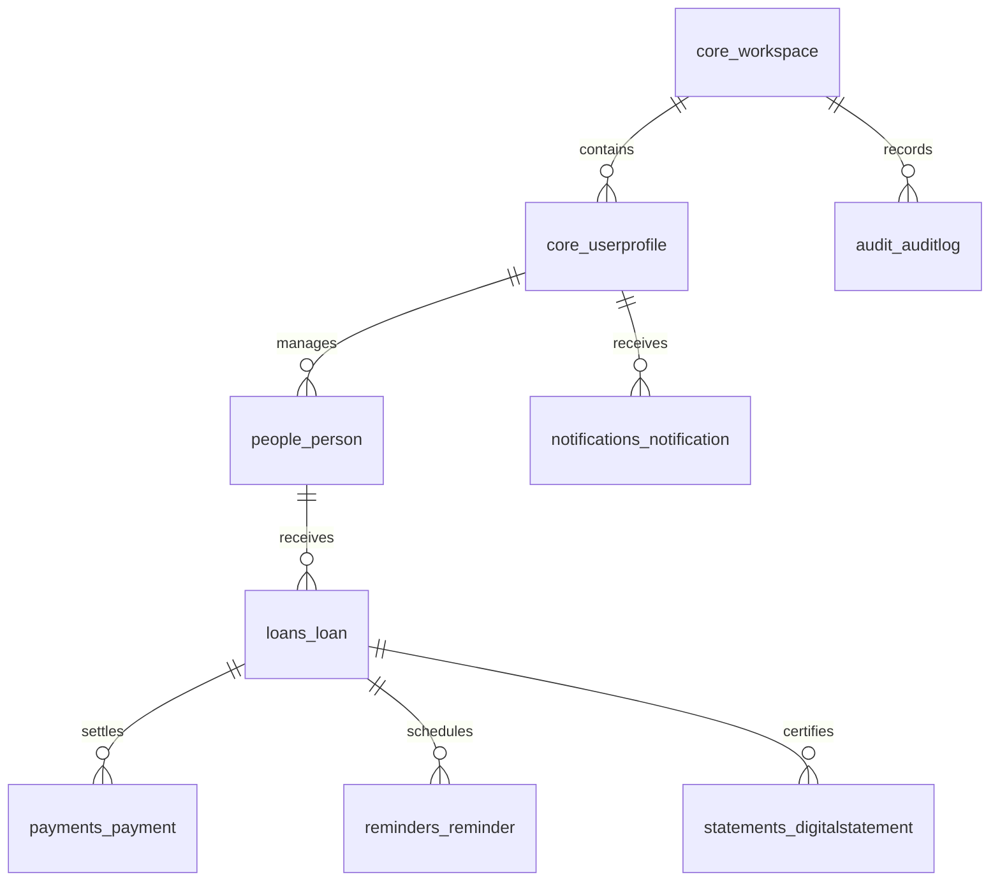
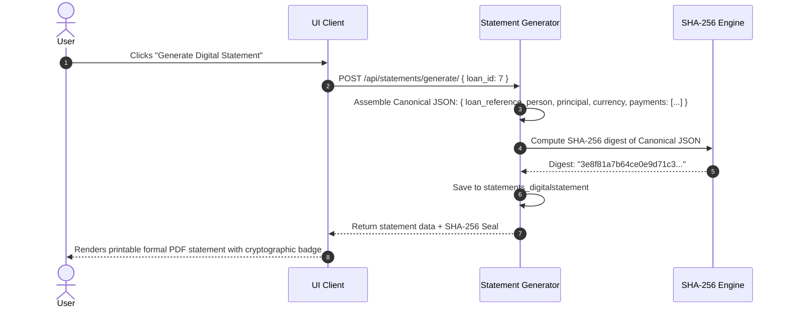

# LendGuard v2.0 — Comprehensive Technical Specification & Engineering Reference Manual

**Authoritative Technical Baseline • Core Engines • Data Models • User Flows • API Contracts • Testing Matrix**  
*Document Version:* `2.0.0-PROD` | *Target Systems:* Python/FastAPI/Django DRF Backend • React.js Web • Flutter Mobile • PostgreSQL 16  
*Classification:* Technical Documentation, QA Test Baseline & Pair-Programming Architecture Reference

---

## 1. Executive Summary & Product Architecture Philosophy

### 1.1 Core Mission
LendGuard is an authoritative, multi-currency financial ledger and debt-recovery platform designed for individuals and commercial enterprises to record money lent, repayment installments, due dates, overdue aging schedules, and cryptographically verified digital statements.

$$\text{The Prime Objective: }\textit{"Know who owes you, how much, when due, what was repaid, and what remains."}$$

### 1.2 The Golden Architectural Rule
```
[ Frontend Client ]          [ Python Backend ]             [ PostgreSQL 16 ]            [ Event Bus ]
Collects & Displays   ───►   Validates & Computes    ───►   ACID Persistence     ───►    Dispatches Reminders
(React Web / Flutter)        (Balance/Status Engine)         (Authoritative Ledger)      (Push / SMS / WhatsApp)
```
1. **Frontend Non-Authoritative Rule**: Frontend clients (React.js, Flutter) are strictly presentation layers. They never compute balances, mutate financial state independently, or override backend calculations.
2. **Backend Authoritative Rule**: All balance calculations, interest accruals, overdue status derivations, and reminder triggers are strictly evaluated by Python backend domain engines.
3. **Database ACID Ledger**: PostgreSQL is the single source of truth. Every transaction is auditable, decimal-precise, and protected by foreign key constraints and Row-Level Security (RLS).
4. **Zero Float Financial Arithmetic**: Floating-point types (`float`, `double`) are strictly prohibited in financial math. All monetary computations use exact `Decimal(12, 2)` representations.

---

## 2. End-to-End Technology Stack

| Layer | Technology Selected | Version / Spec | Responsibility |
| :--- | :--- | :--- | :--- |
| **Web Frontend** | React.js | 19.x / Vite 8.x | Desktop & tablet web application, responsive SPA |
| **Styling System** | Vanilla CSS Glassmorphism | CSS3 Variables | Premium dark/light themes, zero-dependency layout |
| **Icons & Visuals** | Lucide React + 3D Visuals | Latest | Crisp SVG iconography and bespoke fintech artwork |
| **Mobile Frontend** | Flutter + Dart | 3.x | Native iOS and Android application |
| **Mobile Storage** | Flutter Secure Storage | iOS Keychain / Android Keystore | Hardware-backed encrypted credential vault |
| **Backend Framework**| Python Django REST Framework | Python 3.14 / Django 5.2 | High-throughput REST API, ORM, and domain engines |
| **Database** | PostgreSQL | 16.x | Relational financial ledger with ACID compliance |
| **API Architecture** | REST + OpenAPI 3.0 | DRF Spectacular | Canonical API contract consumed by all clients |
| **Security & Hashing**| SHA-256 + PBKDF2 | FIPS 180-4 / NIST | Digital statement signatures and password hashing |
| **Background Jobs** | Celery / Redis | Latest | Asynchronous reminder dispatch & aging jobs |

---

## 3. Exhaustive Data Models & Database Schema



### 3.1 `core_workspace` (Tenant & Multi-User Isolation)
| Column | Type | Constraints | Description |
| :--- | :--- | :--- | :--- |
| `id` | `BIGSERIAL` | Primary Key | Unique workspace identifier |
| `name` | `VARCHAR(150)` | NOT NULL | Workspace/Organization title |
| `slug` | `VARCHAR(100)` | UNIQUE, NOT NULL | URL-safe workspace slug |
| `owner_id` | `INTEGER` | FK (`auth_user.id`) | Primary account owner |
| `created_at` | `TIMESTAMPTZ` | NOT NULL | Workspace creation timestamp |

### 3.2 `people_person` (Borrower & Contact Directory)
| Column | Type | Constraints | Description |
| :--- | :--- | :--- | :--- |
| `id` | `BIGSERIAL` | Primary Key | Unique person record ID |
| `workspace_id` | `BIGINT` | FK (`core_workspace.id`) | Tenant partition key |
| `created_by_id`| `INTEGER` | FK (`auth_user.id`) | User who created the contact |
| `name` | `VARCHAR(100)` | NOT NULL | Borrower's legal or display name |
| `mobile` | `VARCHAR(20)` | NULLABLE | Phone number with country code |
| `email` | `VARCHAR(254)` | NULLABLE | Email address for digital statements |
| `relationship` | `VARCHAR(30)` | `friend\|family\|business\|other` | Relationship categorization |
| `notes` | `TEXT` | NULLABLE | Encrypted private lender notes |
| `tags` | `VARCHAR(255)` | NULLABLE | Comma-delimited search tags |
| `is_archived` | `BOOLEAN` | DEFAULT `FALSE` | Soft-delete flag (preserves ledger) |

### 3.3 `loans_loan` (The Authoritative Lending Ledger)
| Column | Type | Constraints | Description |
| :--- | :--- | :--- | :--- |
| `id` | `BIGSERIAL` | Primary Key | Unique loan ID |
| `loan_reference` | `VARCHAR(30)` | UNIQUE, NOT NULL | Human-readable ID (`LG-2026-0008-8863`) |
| `person_id` | `BIGINT` | FK (`people_person.id`), ON DELETE RESTRICT | Linked borrower record |
| `created_by_id`| `INTEGER` | FK (`auth_user.id`) | Creditor / User ID |
| `principal_amount`| `NUMERIC(12,2)`| NOT NULL, `> 0` | Original principal lent |
| `currency` | `VARCHAR(3)` | NOT NULL, DEFAULT `'INR'` | ISO 4217 Currency (`INR`, `EUR`, `USD`) |
| `date_given` | `DATE` | NOT NULL | Date capital was disbursed |
| `due_date` | `DATE` | NOT NULL | Agreed maturity / due date |
| `purpose` | `VARCHAR(255)` | NULLABLE | Loan purpose (e.g. "Business Bridge") |
| `status` | `VARCHAR(20)` | `OPEN\|PARTIALLY_PAID\|PAID\|CANCELLED\|WRITTEN_OFF` | Authoritative financial state |
| `notes` | `TEXT` | NULLABLE | Terms, promissory reference |

### 3.4 `payments_payment` (Immutable Repayment Ledger)
| Column | Type | Constraints | Description |
| :--- | :--- | :--- | :--- |
| `id` | `BIGSERIAL` | Primary Key | Unique payment ID |
| `loan_id` | `BIGINT` | FK (`loans_loan.id`), ON DELETE CASCADE | Linked loan agreement |
| `amount` | `NUMERIC(12,2)`| NOT NULL, `> 0` | Repayment amount |
| `payment_date` | `DATE` | NOT NULL | Date payment was received |
| `payment_method`| `VARCHAR(30)` | `CASH\|BANK_TRANSFER\|UPI\|CHEQUE\|OTHER` | Payment settlement method |
| `transaction_reference`| `VARCHAR(100)`| NULLABLE | External bank/UPI reference |
| `is_void` | `BOOLEAN` | DEFAULT `FALSE` | Void flag (preserves audit trail) |
| `void_reason` | `VARCHAR(255)` | NULLABLE | Mandatory reason if voided |

### 3.5 `statements_digitalstatement` (Cryptographic Proof of Debt)
| Column | Type | Constraints | Description |
| :--- | :--- | :--- | :--- |
| `id` | `BIGSERIAL` | Primary Key | Unique statement ID |
| `loan_id` | `BIGINT` | FK (`loans_loan.id`) | Target loan |
| `statement_hash`| `VARCHAR(64)` | NOT NULL | SHA-256 digest of canonical data |
| `data_snapshot`| `JSONB` | NOT NULL | Immutable JSON snapshot of loan & payments |
| `generated_at` | `TIMESTAMPTZ` | NOT NULL | Generation timestamp |

---

## 4. Deterministic Core Engines & Business Calculations

```
                                  ┌───────────────────────────┐
                                  │   LOAN (Principal, Date)  │
                                  └─────────────┬─────────────┘
                                                │
                                                ▼
┌───────────────────────────┐     ┌───────────────────────────┐     ┌───────────────────────────┐
│     PAYMENTS LEDGER       │────►│      BALANCE ENGINE       │────►│       STATUS ENGINE       │
│ (Sum non-void repayments) │     │ (Principal - Repayments)  │     │ (Financial & Time Matrix) │
└───────────────────────────┘     └─────────────┬─────────────┘     └─────────────┬─────────────┘
                                                │                                 │
                                                ▼                                 ▼
                                  ┌───────────────────────────┐     ┌───────────────────────────┐
                                  │   AGING / DELINQUENCY     │     │      REMINDER ENGINE      │
                                  │  (0-7d, 8-30d, 31-60d, 60+)│     │  (Auto-Suppression Rule)  │
                                  └───────────────────────────┘     └───────────────────────────┘
```

### 4.1 Balance Engine
1. **Mathematical Definition**:
   $$\text{Total Repaid} = \sum_{i=1}^{n} \text{Payment}_i \quad \forall \text{ Payment}_i \text{ where } \text{is\_void} = \text{False}$$
   $$\text{Outstanding Balance} = \max\left(0, \text{Principal Amount} + \text{Accrued Charges} - \text{Total Repaid}\right)$$
2. **Rounding & Decimal Safety**: All calculations use Python `Decimal` with `ROUND_HALF_UP` to two decimal places. Floating-point binary representation errors ($0.1 + 0.2 \neq 0.3$) are prohibited.

### 4.2 Status Engine (2-Dimensional State Matrix)
A loan's state is evaluated simultaneously across two independent axes:

| Financial Dimension | Condition | Output Value |
| :--- | :--- | :--- |
| **Unsettled** | $\text{Outstanding} = \text{Principal} \land \text{Total Repaid} = 0$ | `OPEN` |
| **Partially Settled**| $0 < \text{Outstanding} < \text{Principal} \land \text{Total Repaid} > 0$ | `PARTIALLY_PAID` |
| **Fully Settled** | $\text{Outstanding} = 0 \lor \text{Total Repaid} \ge \text{Principal}$ | `PAID` |
| **Nullified** | Manually cancelled by lender | `CANCELLED` |
| **Default Write-Off**| Bad debt deemed unrecoverable | `WRITTEN_OFF` |

| Time Dimension | Condition | Output Value |
| :--- | :--- | :--- |
| **Upcoming** | $\text{Current Date} < \text{Due Date}$ | `UPCOMING` |
| **Due Today** | $\text{Current Date} = \text{Due Date}$ | `DUE_TODAY` |
| **Overdue** | $\text{Current Date} > \text{Due Date} \land \text{Outstanding} > 0$ | `OVERDUE` |

**Precedence Rules**:
- `PAID` takes absolute precedence over `OVERDUE`. A settled loan is never shown as overdue.
- `CANCELLED` loans are excluded from all active portfolio calculations.

### 4.3 Overdue Aging Engine (Deterministic Delinquency Buckets)
When $\text{Days Overdue} = \text{Current Date} - \text{Due Date} > 0$ and $\text{Outstanding} > 0$:

$$\text{Aging Bucket} = \begin{cases} 
\textbf{0–7 Days} & \text{if } 1 \le \text{Days Overdue} \le 7 \\ 
\textbf{8–30 Days} & \text{if } 8 \le \text{Days Overdue} \le 30 \\ 
\textbf{31–60 Days} & \text{if } 31 \le \text{Days Overdue} \le 60 \\ 
\textbf{60+ Days} & \text{if } \text{Days Overdue} \ge 61 
\end{cases}$$

$$\text{Portfolio Recovery Rate (\%)} = \left( \frac{\sum \text{Total Repaid}}{\sum \text{Principal Lent}} \right) \times 100$$

### 4.4 Reminder Engine & Smart Auto-Suppression
- **Trigger Milestones**: $T-7\text{ days}$, $T-3\text{ days}$, $T-1\text{ day}$, $T-0\text{ (Due Today)}$, and recurring overdue follow-ups.
- **Smart Suppression Rule**: When a loan reaches $\text{Outstanding} = 0$, all existing queued reminders for that loan ID are marked `is_active = False` to prevent embarrassing notifications for already settled debts.

### 4.5 Multi-Currency Conversion & Parity Engine
LendGuard stores every loan in its native disbursed currency (e.g. EUR, INR, USD). For unified portfolio aggregation:

$$\text{Amount in Base} = \text{Amount}_{\text{src}} \times \left( \frac{\text{Parity}_{\text{src}}}{\text{Parity}_{\text{base}}} \right)$$

---

## 5. Screen Inventory & Functional UI Specifications (P01 – P30)

| Screen ID | Screen Name | Key UI Elements | Primary Business Function |
| :--- | :--- | :--- | :--- |
| **P01** | Splash Screen | Brand Logo, version tag, health-check pulse | Initializes offline cache, checks backend API status |
| **P02** | Welcome Portal | 3-Slide looping carousel, feature pills, mode toggle | Hero presentation of core product capabilities |
| **P03** | Sign In | Username/Email, password show/hide, 1-Click test | Authenticates user and sets session token |
| **P04** | Email Sign Up | Name, email, password, confirm password | Registers new user; redirects to login (no auto-auth) |
| **P05** | Mobile Sign Up | Phone input, international dial code, terms check | Prepares mobile OTP identity creation |
| **P06** | OTP Verification | 6-digit PIN input, timer countdown, resend CTA | Validates SMS verification code |
| **P07** | Forgot Password | Email input, reset link request | Generates secure password reset token |
| **P08** | Profile Setup | Base currency selector, display name, timezone | Configures initial user preferences |
| **P09** | Biometric Lock | Fingerprint/FaceID prompt (Mobile only) | Hardware-backed local app authentication |
| **P10** | **Dashboard** | 4 KPI Cards, Overdue Hub, Quick Actions, Due Dates, 3D Exposure Stack Deck | Central portfolio overview and urgency hub |
| **P11** | **People Directory** | Search bar, tag filter, borrower cards, Add CTA | Contact listing with live individual exposure badges |
| **P12** | Add/Edit Person | Name, mobile, email, relationship, notes, tags | CRUD borrower directory management |
| **P13** | **Person Details Dossier** | Multi-currency badge strip, loan cards, recovery bar, settlement CTA | Comprehensive 360° financial dossier for a single borrower |
| **P14** | **Lending Ledger** | Search, status filter, multi-currency chips, table | Complete authoritative ledger of all loans |
| **P15** | Record New Loan | Person dropdown, principal, currency, due date | Creates a new loan transaction |
| **P16** | Loan Details Drawer | Repayment timeline, balance breakdown, action CTAs| Expandable drawer showing historical repayments |
| **P17** | Record Payment Modal | Amount, date, payment method, reference, overpay check| Records repayment and recalculates loan balance |
| **P18** | Payment History | Filter by method/date, void action button | Chronological transaction log with void capabilities |
| **P19** | Reminders Hub | Active rules, reminder templates, schedule table | Manages notification cadences |
| **P20** | Notification Center | Dropdown list, unread badge, mark-as-read CTA | In-app alerts for due dates and payments |
| **P21** | **Overdue Aging Report** | 4 Bucket summary cards, risk distribution bars | Aging analysis categorized by days past due |
| **P22** | **EMI / Loan Calculator** | Principal, rate, tenure, frequency, amortization table | Interactive simulation tool with "Lend with Terms" CTA |
| **P23** | **Digital IOU / Statement**| Canonical summary, SHA-256 seal, print/PDF button | Tamper-evident printable debt confirmation certificate |
| **P24** | Settings Overview | Tabbed admin hub (General, Security, API, Backup) | Account management center |
| **P25** | Security Center | Active sessions, password update, token refresh | Credential and session management |
| **P26** | Notification Settings| SMS, WhatsApp, Email, Quiet hours toggles | Configures automated alert channels |
| **P27** | Backup & Export | Export CSV/JSON, purge database button | Data portability and complete reset actions |
| **P28** | Integrations Hub | Webhook secret, API keys, webhook test ping | Developer integrations and external services |
| **P29** | Subscription Plans | Free, Pro, Enterprise tier comparison | Plan entitlements and limits |
| **P30** | Help & Support | FAQ, legal disclaimer, contact support | Guidance on promissory enforceability |

---

## 6. Master End-to-End User Flows

### 6.1 Loan Origination to Final Settlement Flow
```mermaid
sequenceDiagram
    autonumber
    actor Lender
    participant Frontend as React / Flutter Client
    participant Backend as Python Backend (DRF)
    participant DB as PostgreSQL Database
    participant Reminder as Reminder Engine

    Lender->>Frontend: Selects Borrower, Enters Amount (€25,000), Sets Due Date
    Frontend->>Backend: POST /api/loans/ { person: 6, principal: 25000, currency: 'EUR', due_date: '2026-09-30' }
    Backend->>Backend: Validate principal > 0, generate loan_reference 'LG-2026-0007-8978'
    Backend->>DB: INSERT into loans_loan (status='OPEN')
    Backend->>Reminder: Schedule reminders for T-7, T-3, T-1, Due Date
    Backend-->>Frontend: 201 Created (Loan Object + Balance { outstanding: 25000, repaid: 0 })
    Frontend-->>Lender: Displays new loan in Ledger with OPEN & UPCOMING status

    Note over Lender, Backend: Later: Borrower pays €15,000 partial payment
    Lender->>Frontend: Clicks "Record Payment" -> Enters €15,000
    Frontend->>Backend: POST /api/payments/ { loan: 7, amount: 15000, method: 'BANK_TRANSFER' }
    Backend->>Backend: Verify amount <= outstanding (€25,000)
    Backend->>DB: INSERT into payments_payment
    Backend->>Backend: Balance Engine computes outstanding = €10,000 (status -> 'PARTIALLY_PAID')
    Backend-->>Frontend: 201 Created (Updated Balance & Transaction Receipt)

    Note over Lender, Backend: Later: Borrower pays remaining €10,000
    Lender->>Frontend: Records final €10,000 repayment
    Frontend->>Backend: POST /api/payments/ { loan: 7, amount: 10000 }
    Backend->>Backend: Balance Engine computes outstanding = 0 (status -> 'PAID')
    Backend->>Reminder: Suppress all future reminders for Loan 7
    Backend-->>Frontend: 201 Created (status: 'PAID', is_fully_paid: true)
    Frontend-->>Lender: Displays Green PAID Badge; removes from Overdue list
```

### 6.2 Digital Statement & Cryptographic SHA-256 Seal Flow


---

## 7. REST API Contract & Endpoint Reference

### 7.1 Authentication
- `POST /api/auth/login/`: `{ username, password }` $\rightarrow$ `{ token, user }`
- `POST /api/auth/register/`: `{ username, email, password, first_name, last_name }` $\rightarrow$ `{ success, message }`
- `GET /api/auth/profile/`: Retrieve current user profile and preferences.

### 7.2 People Directory
- `GET /api/people/`: List all active contacts with exposure aggregates.
- `POST /api/people/`: `{ name, mobile, email, relationship, notes, tags }`
- `GET /api/people/{id}/`: Detail view including full loan history and repayments.
- `POST /api/people/{id}/archive/`: Soft-archive contact.

### 7.3 Loans Ledger
- `GET /api/loans/`: Query filters: `status`, `currency`, `time_status`, `search`.
- `POST /api/loans/`: `{ person, principal_amount, currency, date_given, due_date, purpose }`
- `POST /api/loans/{id}/cancel/`: Mark loan as cancelled (removes from active portfolio).
- `POST /api/loans/{id}/write_off/`: Mark bad debt as written off.

### 7.4 Payments & Recoveries
- `GET /api/payments/`: List repayment transactions.
- `POST /api/payments/`: `{ loan, amount, payment_date, payment_method, transaction_reference }`
- `POST /api/payments/{id}/void_payment/`: `{ void_reason }` (Soft reversal, restores loan balance).

### 7.5 Reports & Portfolio Analytics
- `GET /api/core/dashboard/`: Returns portfolio aggregates: `total_lent`, `total_repaid`, `total_outstanding`, `overdue_count`, `currency_breakdown`, `recovery_rate`.
- `GET /api/core/aging-report/`: Returns loans categorized into `0-7d`, `8-30d`, `31-60d`, `60+d` buckets.

---

## 8. Exhaustive QA Test Matrix & Technical Verification Plan

```
┌────────────────────────────────────────────────────────────────────────┐
│                        QA TEST SUITE BREAKDOWN                         │
├──────────────────┬──────────────────┬─────────────────┬────────────────┤
│ Financial Logic  │ Security & Auth  │ State & Engines │ Edge Cases     │
│ • Precision      │ • IDOR Isolation │ • Aging Buckets │ • Overpayment  │
│ • Currency Convs │ • Token Expiry   │ • Suppression   │ • Zero Balance │
│ • Parity Rates   │ • Rate Limiting  │ • Precedence    │ • Void Rollback│
└──────────────────┴──────────────────┴─────────────────┴────────────────┘
```

### 8.1 Financial Logic & Balance Calculation Tests
| Test ID | Test Scenario | Input Data | Expected Outcome | Pass/Fail Criteria |
| :--- | :--- | :--- | :--- | :--- |
| **TC-FIN-01**| Standard Loan Creation | Principal = ₹50,000.00 | Outstanding = ₹50,000.00, Status = `OPEN` | Balance equals principal exactly |
| **TC-FIN-02**| Partial Repayment | Repayment = ₹20,000.00 | Outstanding = ₹30,000.00, Status = `PARTIALLY_PAID` | Balance reduces by ₹20,000 |
| **TC-FIN-03**| Full Final Repayment | Repayment = ₹30,000.00 | Outstanding = ₹0.00, Status = `PAID` | Status becomes `PAID`, `is_fully_paid = True` |
| **TC-FIN-04**| Overpayment Rejection | Repayment = ₹35,000 on ₹30,000 balance | Warning / Validation Error | Backend rejects payment > outstanding |
| **TC-FIN-05**| Payment Void Reversal | Void payment of ₹20,000 | Outstanding increases from ₹30,000 back to ₹50,000 | Balance restored without record deletion |
| **TC-FIN-06**| Multi-Currency Isolation| Loan A: €25,000, Loan B: ₹1,00,000 | Stored separately in original currencies | No artificial cross-currency blending |

### 8.2 State Engine & Overdue Aging Tests
| Test ID | Test Scenario | Input Data | Expected Outcome | Pass/Fail Criteria |
| :--- | :--- | :--- | :--- | :--- |
| **TC-STA-01**| Due Date in Future | Due Date = $T+5\text{ days}$ | `time_status = UPCOMING` | Correct time classification |
| **TC-STA-02**| Due Date is Today | Due Date = Today | `time_status = DUE_TODAY` | Correct time classification |
| **TC-STA-03**| Overdue 5 Days | Due Date = $T-5\text{ days}$, Balance > 0 | `time_status = OVERDUE`, Bucket: `0–7 Days` | Correct aging bucket |
| **TC-STA-04**| Overdue 20 Days | Due Date = $T-20\text{ days}$, Balance > 0| `time_status = OVERDUE`, Bucket: `8–30 Days`| Correct aging bucket |
| **TC-STA-05**| Overdue 45 Days | Due Date = $T-45\text{ days}$, Balance > 0| `time_status = OVERDUE`, Bucket: `31–60 Days`| Correct aging bucket |
| **TC-STA-06**| Overdue 75 Days | Due Date = $T-75\text{ days}$, Balance > 0| `time_status = OVERDUE`, Bucket: `60+ Days` | Correct aging bucket |
| **TC-STA-07**| Overdue Settled Priority| Due Date = $T-10\text{ days}$, Balance = 0| `status = PAID`, Removed from Overdue list | `PAID` overrides overdue |

### 8.3 Security, Multi-Tenant & Authorization Tests
| Test ID | Test Scenario | Attack / Action | Expected Outcome | Pass/Fail Criteria |
| :--- | :--- | :--- | :--- | :--- |
| **TC-SEC-01**| Cross-Tenant IDOR Attempt | User A attempts `GET /api/loans/{id_of_user_B}/`| `404 Not Found` or `403 Forbidden` | Complete tenant isolation |
| **TC-SEC-02**| Unauthenticated Access | `GET /api/loans/` without Token | `401 Unauthorized` | Endpoints protected |
| **TC-SEC-03**| SQL Injection Injection | Query: `?search=' OR 1=1 --` | Safely sanitized by ORM | Zero data leak |
| **TC-SEC-04**| SHA-256 Statement Tamper | Mutate payload after hash creation | Cryptographic seal validation fails | Tamper-evident proof |

---

## 9. Deployment, Local Run & Verification Guide

### 9.1 Backend Setup & Execution
```bash
cd Backend
# Activate Python Virtual Environment
source venv/bin/activate
# Run Database Migrations
python manage.py migrate
# Start Django DRF Development Server
python manage.py runserver 127.0.0.1:8000
```

### 9.2 Frontend Web Setup & Execution
```bash
cd Frontend
# Install dependencies
npm install
# Start Vite Development Server
npm run dev
# Run Production Bundle Build Verification
npm run build
```

---

## 10. Summary & Sign-off

This document serves as the **master engineering blueprint and testing baseline** for LendGuard v2.0. Any new code or enhancement must strictly adhere to the calculation models, database constraints, precision rules, and state precedence specifications documented herein.
